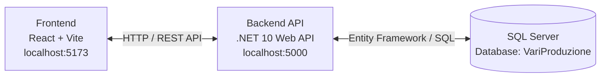

# Architecture Diagram

This diagram provides a high-level overview of the VariProduzione system components and their interactions.

- **Frontend**: The React single-page application interacts with the backend over HTTP.
- **API**: The .NET 10 Minimal API serves as the bridge between the UI and the database.
- **Database**: SQL Server stores all production state.
