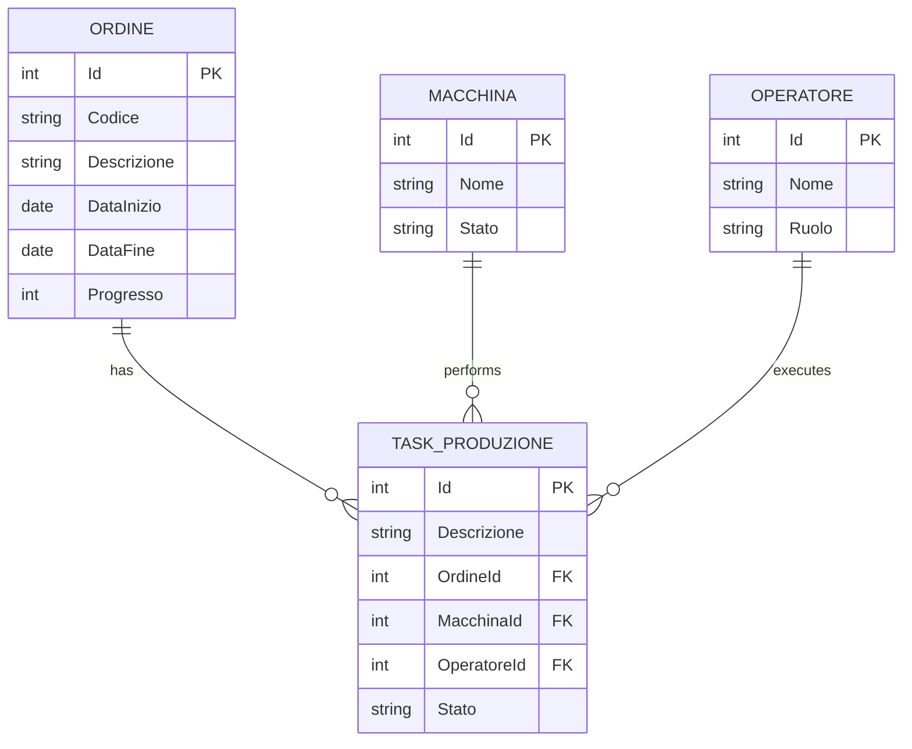

# Database Diagram

Entity-Relationship diagram for the VariProduzione database.

The database structure revolves around production `Orders` which are broken down into `Tasks`. Each `Task` is assigned to a `Machine` and an `Operator`.
