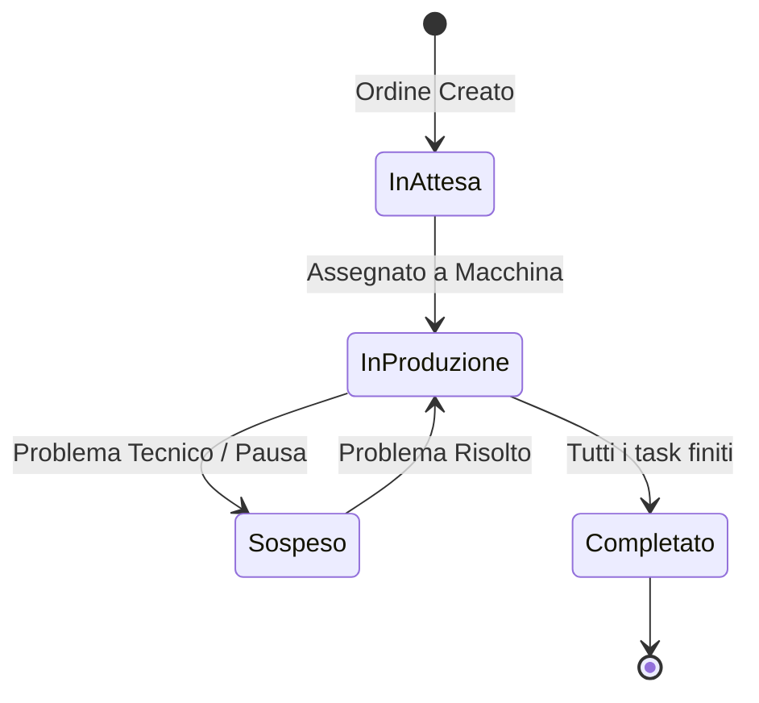

# Production Workflow

This diagram outlines the lifecycle of a production order within the VariProduzione system.

1. **InAttesa (Pending)**: The order is created but not yet assigned to any machine.
2. **InProduzione (In Production)**: The order's tasks are actively being worked on by assigned operators and machines.
3. **Sospeso (Suspended)**: Work has halted due to machine maintenance or other issues.
4. **Completato (Completed)**: The order is finished and ready for delivery.
