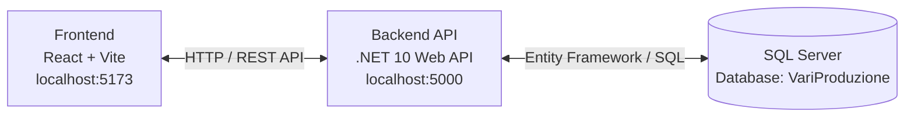

# ⚙️ Varese Production System (VariProduzione)

Sistema di gestione produzione industriale per monitorare ordini, macchine, operatori e task in tempo reale.


---

## 📑 Indice

- [Architettura](#-architettura)
- [Prerequisiti](#-prerequisiti)
- [Installazione](#-installazione)
- [Configurazione Database](#-configurazione-database)
- [Avvio](#-avvio)
- [API Endpoints](#-api-endpoints)
- [Deploy](#-deploy)
- [Struttura Progetto](#-struttura-progetto)
- [Troubleshooting](#-troubleshooting)

---

## 🏗️ Architettura



## Stack Tecnologico

| Layer       | Tecnologia                | Configurazione |
|--------------|----------------------------|----------------|
| **Frontend** | React 18 + Vite           | `localhost:5173` (dev) / `localhost:3000` (prod) |
| **Backend**  | .NET 10 Minimal API       | `http://localhost:5000` / `https://localhost:5001` |
| **Database** | SQL Server 2022 / LocalDB | Porta `1433` |

---

## 📋 Prerequisiti

### Backend
- [.NET SDK 10.0](https://dotnet.microsoft.com/download)
- [SQL Server Express / LocalDB](https://www.microsoft.com/sql-server/sql-server-downloads) oppure Docker

### Frontend
- [Node.js 18+](https://nodejs.org/)
- npm 9+

### Opzionale
- [Docker Desktop](https://www.docker.com/products/docker-desktop)
- [SQL Server Management Studio (SSMS)](https://aka.ms/ssmsfullsetup)

---

## 🚀 Installazione

### 1. Clona il repository

```bash
git clone https://github.com/msabetta/VariProduzione.git
cd VariProduzione
```

### 2. Installa dipendenze Backend

```bash
cd VariProduzione/VariProduzioneApi
dotnet restore
dotnet build
```

### 3. Installa dipendenze Frontend

```bash
cd ../vari-produzione-frontend
npm install
```

---

## 🗄️ Configurazione Database

### Opzione A: SQL Server LocalDB (consigliato per sviluppo)

```bash
# Crea istanza LocalDB
sqllocaldb c VariProduzioneDB
sqllocaldb s VariProduzioneDB
```

Connection string in `appsettings.json`:
```json
"DefaultConnection": "Server=(localdb)\\VariProduzioneDB;Database=VariProduzione;Trusted_Connection=true;TrustServerCertificate=true;Encrypt=false"
```

### Opzione B: SQL Server Express

```bash
# Installa SQL Server Express
choco install sql-server-express
```

Connection string:
```json
"DefaultConnection": "Server=localhost\\SQLEXPRESS;Database=VariProduzione;Trusted_Connection=true;TrustServerCertificate=true;Encrypt=false"
```

### Opzione C: Docker

```bash
docker run -e "ACCEPT_EULA=Y" -e "MSSQL_SA_PASSWORD=YourStrong@Passw0rd" -p 1433:1433 --name sqlserver -d mcr.microsoft.com/mssql/server:2022-latest
```

---

## ▶️ Avvio

### Avvia Backend (terminale 1)

```bash
cd VariProduzione/VariProduzioneApi
dotnet run
```

Verifica:
- API Root: http://localhost:5000/
- Health Check: http://localhost:5000/health
- Documentazione: http://localhost:5000/scalar
- Dashboard API: http://localhost:5000/api/produzione/dashboard

### Avvia Frontend (terminale 2)

```bash
cd VariProduzione/vari-produzione-frontend
npm run dev
```

Apri il browser su: http://localhost:5173

---

## 🔌 API Endpoints

### Produzione

| Metodo | Endpoint | Descrizione |
|--------|----------|-------------|
| GET | `/api/produzione/dashboard` | KPI dashboard completa |
| GET | `/api/produzione/ordini-ritardo` | Lista ordini in ritardo |
| GET | `/api/produzione/gantt` | Dati per diagramma Gantt |
| POST | `/api/produzione/ordini` | Crea nuovo ordine |
| PUT | `/api/produzione/ordini/{id}/progresso` | Aggiorna progresso ordine |

### Gestione

| Metodo | Endpoint | Descrizione |
|--------|----------|-------------|
| GET | `/api/gestione/macchine` | Lista macchine |
| GET | `/api/gestione/operatori` | Lista operatori |

### Sistema

| Metodo | Endpoint | Descrizione |
|--------|----------|-------------|
| GET | `/` | Info applicazione |
| GET | `/health` | Health check |

---

## 📦 Deploy

### Build produzione

```bash
# Backend
dotnet publish -c Release -o ./publish

# Frontend
npm run build
# Output in ./dist
```

### Docker Compose

```bash
cd Config
docker-compose up -d
```

Servizi avviati:
- Database: `localhost:3306` (MariaDB)
- API: `localhost:5000`
- Frontend: `localhost:3000`

---

## 📁 Struttura Progetto

```
VariProduzione/
├── .gitignore
├── README.md
├── global.json                    # SDK .NET 10
│
├── VariProduzione/
│   ├── VariProduzioneApi/         # Backend .NET 10
│   │   ├── Program.cs
│   │   ├── appsettings.json
│   │   ├── VariProduzioneApi.csproj
│   │   │
│   │   ├── Models/                # Entità EF Core
│   │   │   ├── Enums.cs
│   │   │   ├── Ordine.cs
│   │   │   ├── TaskProduzione.cs
│   │   │   ├── Macchina.cs
│   │   │   └── Operatore.cs
│   │   │
│   │   ├── Data/                  # Database
│   │   │   ├── ProdDbContext.cs
│   │   │   └── DbInitializer.cs
│   │   │
│   │   ├── Services/              # Business logic
│   │   │   ├── IOrdineService.cs
│   │   │   ├── OrdineService.cs
│   │   │   ├── IMacchinaService.cs
│   │   │   ├── MacchinaService.cs
│   │   │   ├── IOperatoreService.cs
│   │   │   └── OperatoreService.cs
│   │   │
│   │   ├── Endpoints/             # Minimal API
│   │   │   ├── ProduzioneEndpoints.cs
│   │   │   └── GestioneEndpoints.cs
│   │   │
│   │   └── DTOs/                  # Data Transfer Objects
│   │       ├── DashboardDto.cs
│   │       ├── AlertDto.cs
│   │       ├── MacchinaStatusDto.cs
│   │       └── GanttDataDto.cs
│   │
│   └── vari-produzione-frontend/  # Frontend React
│       ├── index.html
│       ├── package.json
│       ├── vite.config.js
│       │
│       ├── src/
│       │   ├── main.jsx
│       │   ├── App.jsx
│       │   ├── App.css
│       │   │
│       │   ├── pages/             # Pagine
│       │   │   ├── DashboardPage.jsx
│       │   │   ├── OrdiniPage.jsx
│       │   │   ├── MachinePage.jsx
│       │   │   ├── ImpostazioniPage.jsx
│       │   │   ├── DatabasePage.jsx
│       │   │   └── ProfiloPage.jsx
│       │   │
│       │   └── services/          # API client
│       │       └── api.js
│       │
│       └── public/
│
├── Config/                        # Docker / DevOps
│   ├── docker-compose.yml
│   └── nginx.conf
│
├── Database/                      # Schema SQL (legacy)
│   ├── InitialSchema.sql
│   └── SeedData.sql
│
└── Tests/                         # Test xUnit
    └── VariProduzioneApi.Tests/
```

---

## 🐛 Troubleshooting

### Errore: "A network-related or instance-specific error occurred"

**Causa**: SQL Server non trovato  
**Soluzione**: Verifica che SQL Server sia avviato:

```bash
sqllocaldb i                    # Lista istanze
sqllocaldb s VariProduzioneDB   # Avvia istanza
```

### Errore: "The ASP.NET Core developer certificate is not trusted"

**Soluzione**:
```bash
dotnet dev-certs https --trust
```

### Errore: "No compatible .NET SDK was found"

**Soluzione**: Verifica `global.json` e installa .NET 10:
```bash
dotnet --list-sdks
# Se manca, scarica da https://dotnet.microsoft.com/download
```

### Errore frontend: "process is not defined"

**Causa**: Vite usa `import.meta.env`, non `process.env`  
**Soluzione**: Già corretto in `src/services/api.js`

---

## 👥 Team

| Ruolo | Nome |
|-------|------|
| Sviluppo | Mario Sabetta |

---

## 📄 Licenza

Proprietà di Vari Produzione S.r.l. - Tutti i diritti riservati.

---

## 📞 Supporto

Per assistenza tecnica contattare:  
📧 mario.sabetta@varese.it  
🌐 https://github.com/msabetta/VariProduzione